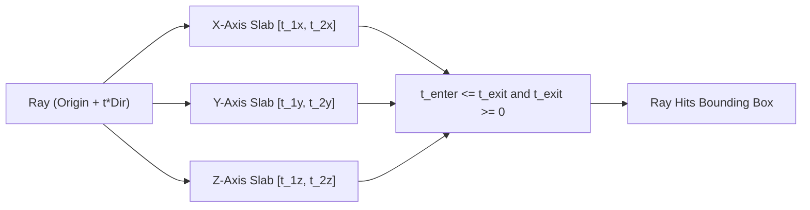

# BVH Ray-AABB Intersection Skill

High-efficiency, zero-dependency Python implementation of **BVH Ray-AABB Slab Intersection** for real-time ray tracing and rendering acceleration.

## Features
- **Slab Method Intersection**: Computes coordinate interval overlaps across 3D planes without trigonometric functions.
- **Fast Hit Distance**: Evaluates closest entry distance \(t_{\min}\) for sorting ray traversal stacks.
- **Zero External Dependencies**: Pure Python standard library.
- **Native MCP Protocol**: JSON-RPC 2.0 stdio server compatible with Claude Desktop, Cursor, and Windsurf.

## Architecture

